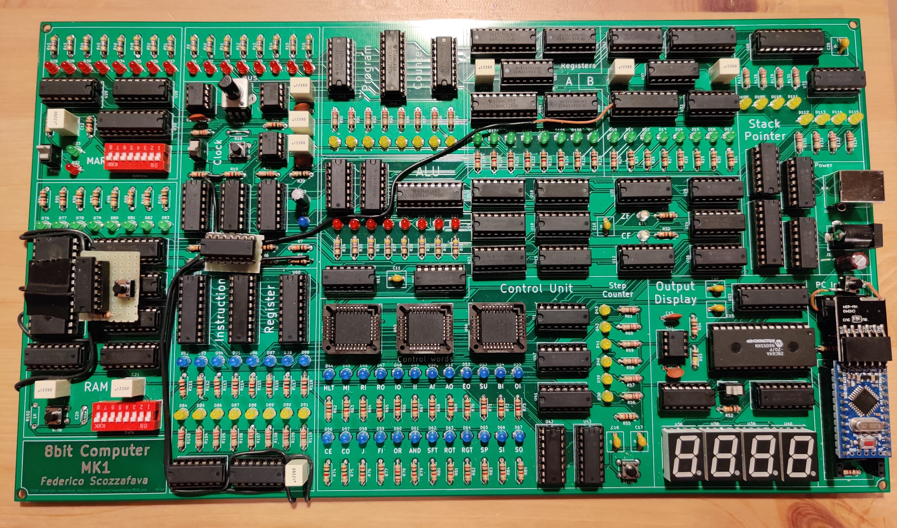

# MK1 8bit Computer

Schematics and code for my home-made 8-bit CPU.

## Overview

During the past month, I designed and built a programmable 8-bit CPU from scratch, out of basic series 74LS logic ICs.

This repository contains pictures, schematics, and code for this project and its companion boards.

* V 1.0 assembled:

* V 1.0 in action:

[VIDEO]

## Architecture

The MK1 CPU is composed of several modules, all connecter though a common 8-bit BUS, the status of each module is shown by dedicated LEDs. 

- The clock module is designed to allow step-by-step execution; in automatic mode the clock speed can be adjusted from 1Hz up to 32KHz.
- The computer programs are stored in RAM and the CPU can be programmed both manually, by inserting binary machine code through dip-switches, and automatically via a USB PC interface. 
  - The Programming interface is designed to be used in conjunction with an **Arduino Nano** or the **Start9** programming board.
  - The **Start9** programming board allows the loading of multiple programs stored on an on-board flash memory without the aid of an external computer device.

- The Addressable memory space is 1024 byte, the instructions are 2 bytes long (first byte for the opcode, the second one for the argument), there are 4 general purpose registers (`A`, `B`, `C`, `D`) and a  `stack pointer` register for subroutine calls.

- The **A**rithmetic **L**ogic **U**nit has a dedicated register for the second operand and supports the following operations:
  - Addition
  - Subtraction
  - OR
  - AND
  - NOT
  - Left/Right Shift
  - Left/Right Rotation

- The Control Unit combinatory logic is implemented using EEPROMs whilst each instruction is realized through micro-instruction for a maximum of 6 micro-steps per instruction, including the fetch cycle. The instruction-set supports both direct and indirect memory access as well as absolute and conditional jumps on carry (`CF`) and zero (`ZF`) ALU flags.

- The computation output can be visualized on a 4-digit display, with a dedicated register, able to represent positive and 2-complement negative numbers both in decimal and hexadecimal format.

- The CPU can be extended thanks to the external BUS interface capable of handling up to 2 peripheral. The communication is bidirectional, the devices can send interrupts to the CPU to notify when new data is available. Interrupts are cleared once the data has been processed.
  - The only available peripheral at the moment is the **Helix** display interface, an ATmega328-driven 2x16 LCD output display.

## Structure

- **MK1 CPU/**:
  - **8bit-computer/**: KiCad project, schematics and PCB design of the **MK1 CPU**.
  - **code/**:
    - microcode.py: generates the binary EEPROM microcode.
    - out_display.py: generates the binary output display EEPROM code.
    - uploader.py: uploads a binary MK1 program to the CPU.
    - mk1_computer_uploader/: Arduino programmer interface sketch.
  - **programs/**: a collection of programs for the MK1 CPU.
- **start9_programming_interface/**: 
  - **programming_interface/**: KiCad project, schematics and PCB design of the **Start9** programming board.
  - **code/**: Arduino code for the programming interface.
- **helix_display_interface/**:
  - **display_interface/**: KiCad project, schematics and PCB design of the **Helix** display interface board.
  - **code/**: Arduino code for the display interface.
- **bus_breakout/**: KiCad project, schematics and PCB design of the external bus connector breakout board.

## Changelog

##### V2.0 (WIP):

- 4 general purposes registers (A, B, C, D)
- Stack Pointer implemented as an up-down counter
- External interface and interrupt handling
- Output display decodes HEX and ASCII values
- Clock speed multipliers
- Control Unit extended with 4 EEPROMs
- Variable step microcode counter length (each instruction uses the minimum amount of micro-steps)
- revisited microcode and instruction-set

##### V1.0:

- Bugfixes.
- `HL` and `STK` address signals available in the `MAR` dip-switch.

##### V0.1:

- Initial release

